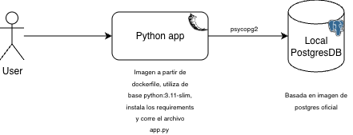

# docker-practica-do13
Repositorio de una aplicación de conexión a una base de datos ambas montadas en local utilizando contenedores de Docker

### Funcionamiento:

Esta es una aplicación de Python, que utiliza flask y psycopg2-binary para manejar las conexiones con la base de datos.
Utiliza la imagen oficial de Docker de Postgres tag 18-trixie. Obtenida desde el docker hub.

La aplicación corre en el puerto 5001 y tiene una interfaz visual que permite elegir una de dos opciones:

- Si no se quiere configurar un .env, se pueden utilizar en un formulario donde se introducen las credenciales de default (que están en el yaml del compose a la vista de todos, tristemente)
- Si sí se quiere configurar el env se puede ingresar directamente con el botón izquierdo a la conexión con la db definida en el env. 

Una vez se ingresa a la conexión aparecen las DBs encontradas, a partir de las cuales se puede seleccionar una y crear tablas nuevas y dentro de cada tabla crear registros nuevos. Estos no se pueden devolver, solo se mapearon las funciones de creación sobre la conexión del postgres.

Esta información persiste en el volumen definido en el .yaml: - postgres_data:/var/lib/postgresql 
Como se mencionó en clase si se baja el compose eliminando los volúmenes las bases se reinician por completo y la información en realidad no se almacena.

En el proyecto se encuentra un .env.example que sirve como guía perfecta para definir las credenciales de acceso para la postgres. Note que si crea dicho archivo esas serán las únicas credenciales para acceder, sea directamente por el botón del env o sea por el formulario, en el formulario ya no funcionarán las credenciales default sino que debe utilizar las definidas en el env.

### Estructura del proyecto

```
docker-practica-do13/
├── templates/
│   ├── index.html          # Página de inicio: elección entre .env o formulario
│   ├── form.html           # Formulario para ingresar credenciales manualmente
│   ├── dashboard.html      # Vista principal tras conectarse
│   ├── database.html       # Vista de las bases de datos disponibles
│   ├── table.html          # Vista de tablas dentro de una base de datos
│   └── result.html         # Resultado de operaciones (crear tabla/registro)
├── app.py                  # Aplicación Flask con la lógica de conexión a Postgres
├── docker-compose.yml      # Definición de los servicios: app y db
├── Dockerfile              # Imagen de la aplicación Python/Flask
├── requirements.txt        # Dependencias de Python (flask, psycopg2-binary)
├── .env.example            # Plantilla para definir credenciales propias
├── esquema_docker.drawio.png
└── README.md
```




### Pasos a seguir para correr la app:
Premisas: El usuario tiene docker y git instalados. 

Primero que nada clone el repositorio en la carpeta de su preferencia utilizando el comando:
```
git clone https://github.com/NatCam22/docker-practica-do13.git
```

Posteriormente puede elegir entre crear su archivo .env basado en el ejemplo (.env.example) o no. 

- En caso de que no quiera, para la conexión utilice las credenciales:
```
user = admin
password = password
DB = mydb
```

No se requiere hacer la descarga de ninguna imagen previamente ya que una es del hub y la otra se construye directamente del dockerfile basada en otra imagen del hub.

El siguiente paso sería pues levantar los contenedores con la definición dada en el yaml utilizando
```
docker compose up
```
Dada la configuración lo que debería hacer esto es:

- Corre un servicio (contenedor) llamado db que utiliza la imagen de postgres del hub, le define unas variables del ambiente dependientes del archivo .env o utiliza las default mencionadas previamente, define un volumen asociado y los puertos para la conexión al servicio.

- Luego corre otro basado en la imagen que construye a partir del dockerfile. Define los puertos, el volumen y establece la condición de que depende de que el servicio db haya sido inicializado. 


Si ya lo había levantado previamente y quiere volverlo a hacer con alguna modificación sobre las imágenes debe utilizar
```
docker compose up --build
```

Una vez los contenedores estén creados y corriendo ya puede acceder a la web utilizando en el navegador la ruta
`localhost:5001`

En principio se puede acceder a la postgres también directamente usando el puerto 5432 pero no es la idea (además no lo probé, no doy fe de su funcionamiento 😅)

###### Al terminar

Para detener la ejecución interrumpa la conexión en la terminal si la tiene aún corriendo utilizando `ctrl+c`

Posteriormente elimine los contenedores y sus volúmenes con
```
docker compose down -v
```
Si no quiere eliminar los volúmenes elimine el `-v`
Si también quiere eliminar las imágenes creadas use:
```
docker compose down --rmi all -v
```
Es equivalente al comando anterior pero incluye también la eliminación de las imágenes.

##### Nota al profe:

Esta nota es para pedir piedad por la entrega tan tardía. Estoy intentando hacer un gran academic comeback. Espero que la práctica cumpla las expectativas :) 